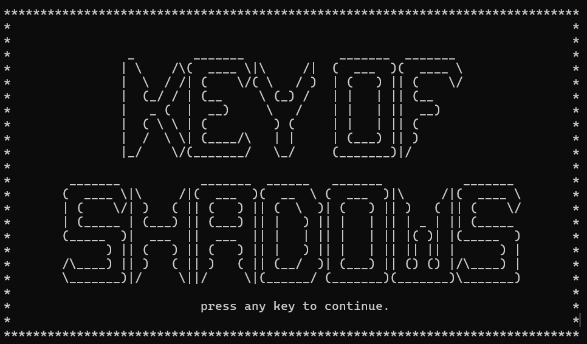
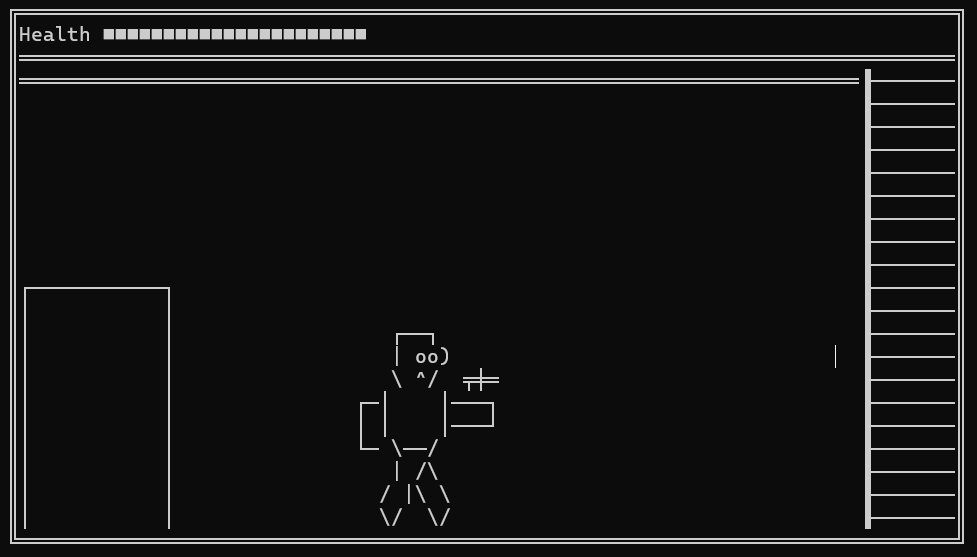
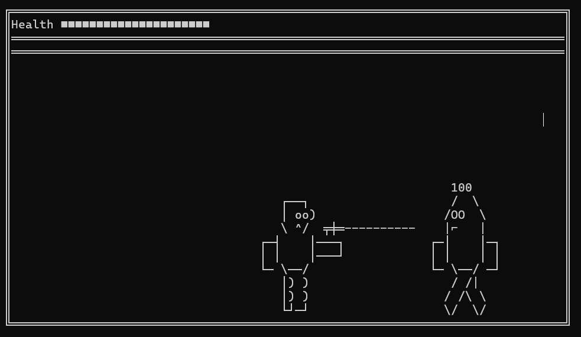

# 🗝️ The Key of Shadows

**The Key of Shadows** is a C++ ASCII-based adventure game that challenges you to explore, survive, and escape! Your mission is to **find the mysterious Key of Shadows**, collect weapons and items, avoid deadly enemies, and locate the **final exit** to freedom.

---

## 🎮 Gameplay Overview

Explore a dynamic ASCII world filled with traps, teleporters, and secrets. You must outsmart enemies, climb ladders, and use powerful weapons to progress. But be warned: the world is dark, and the shadows hold many dangers.

### 🧩 Goal:
Find the **Key of Shadows** and **escape through the exit** without being caught!

---

## ✨ Features

- ✅ **Smooth ASCII Animations**  
- ☠️ **Multiple Enemy Types** with patrol & chase behavior  
- ⚔️ **Weapons**: Pick up and use different weapons to fight or escape  
- 🪜 **Ladders**: Climb vertically to reach new areas  
- 🌀 **Teleportation Portals**: Instantly travel across the map  
- 💎 **Collectables**: Discover hidden items across levels  
- 🗝️ **Final Objective**: Find the Key of Shadows to unlock the exit

---

## 🕹️ Controls

| Key | Action         |
|-----|----------------|
| W   | Move Up        |
| A   | Move Left      |
| S   | Move Down      |
| D   | Move Right     |
| E   | Interact / Pick Up |
| Q   | Use Weapon / Action |

---

## 🖼️ Screenshots

> _You can add your screenshots here! Example layout below._

| Menu Preview | Gameplay Preview | Combat Preview |
|--------------|------------------|----------------|
|  |  |  |

---

## 🧠 Built With

- **Language:** C++  
- **Graphics:** ASCII art using standard console output   
- **Tools:**  VS Code, or Visual Studio

---

## 📁 How to Run

1. Clone the repo:
   ```bash
   git clone https://github.com/your-username/TheKeyOfShadows.git
# The-Key-of-Shadows
Open the project in your C++ IDE.

Enjoy the game!
🙏 Credits
1)Me
2)Hazem Hisham
📜 License
This project is licensed under the MIT License.
See the LICENSE file for more details.

